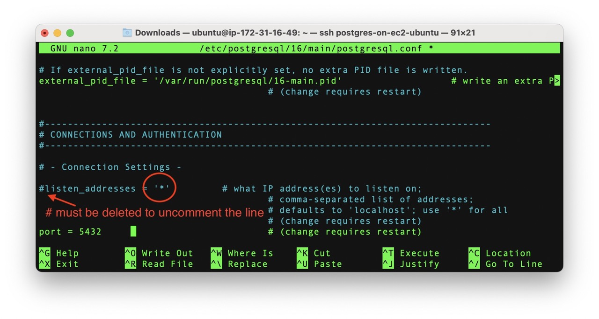

# AWS CLOUD FOR DATA ENGINEERING

## EC2

### 1. TASKS

1.  The cheapest way of creating a database in Cloud - take just a virtual machine (EC2 in our case) and install database by your own. Let's do it.

    a)  Create EC2 t2.micro instance (EBS volume size should be not more than 10GB and security group should be "dilab-training") and add AWS_EC2_full_access_S3 role to it to allow S3 access for your EC2 machine. Name of it as always should be recognizable.\
        NOTE: Use any suitable free distributions of Linux as OS in the EC2 VM.\
        NOTE: In the lecture you saw creation of 128GB disks for EC2, it is just an example for you to understand that EC2 instance could have root volume and mounted volumes, no need to create same big volumes, one 8GB root volume and one 10GB mounted volume will be enough.

    b)  Install Oracle/ or PostgreSQL/ or MySQL on the EC2.\
        NOTE: If OS picked in a. is Linux, use the command line to perform the installation.

        *To install Postgres firstly we update our Ubuntu*

        ```         
        sudo apt-get update - y
        ```

        

        *After it we install Postgres:*\

        ```         
        sudo apt install postgresql - y
        ```

        

        *It's also necessary to create a user postgres for Ubuntu:*\

        ```         
        sudo su postgres
        ```

        

        *To allow access to our DBMS outside our server we need to change some initial Postgres configurations.\
        Firstly, we find where is our "postgresql.conf" file is placed and edit it with nano, changing 'localhost' to \* which means any ip address.*\
        \
        

        *Then, in similar way we find and edit "pg_hba.conf" file. At the end of the file we have to add two following lines:*

        ```         
        host    all    all    0.0.0.0/0   md5
        host    all    all    ::/0        md5
        ```

        

        *It's very important to restart our postgres server after all the manipulations*

        ```         
        sudo systemctl restart postgresql
        ```

        *After it we can check if our Postgres works (active).\
        For Ubuntu it is better to use the following command:*

        ```         
        sudo systemctl status 'postgresql*'
        ```

        

        *And finally let's set a password for our main postgres user:*\
        

    c)  Connect to this database from any SQL client (e.g. DBeaver - very useful IDE because of community edition and possibility to work with almost all most famous databases).

        *To connect my Postgres installed on ec2 Ubuntu server I have used pgAdmin4. Unfortunately, I was able to reach my Postgres only with so called SSH Tunnel, but it works*\
        

        *I see the database created on my ec2 Ubunte server:*\
        

        *We see the same database on the server via psql:*\
        

    d)  Insert your connection configuration (host, database, user, password) for mentors to check the connectivity, screens that you have connected to the db on your EC2 into the Report.

        *Done. See above.*

    e)  Create several objects in the created database ( at least one table, view, procedure ).

        *I created a separate schema:*

        ```         
        CREATE SCHEMA IF NOT EXISTS ec2schema
        ;

        COMMIT
        ;
        ```
        
        *Also I created a sequence, a very simple table (even silly :) ) which has only record_id, user_name and insert_dt columns (something similar to log table):*

        ```
        CREATE SEQUENCE IF NOT EXISTS ec2schema.t_test_id_seq 
        AS              INT
        START WITH      1 
        INCREMENT BY    1
        ;

        COMMIT
        ;


        CREATE TABLE IF NOT EXISTS ec2schema.t_test (
          RECORD_ID                 INT         DEFAULT nextval('ec2schema.t_test_id_seq'),
          USER_NAME                 VARCHAR(250)                        NOT NULL,
          INSERT_DT                 TIMESTAMP                           NOT NULL,
          PRIMARY KEY (RECORD_ID)
        );

        COMMIT
        ;
        ```
        
        *... a VIEW:*

        ```
        DROP VIEW IF EXISTS ec2schema.v_test
        ;

        CREATE VIEW ec2schema.v_test
        AS
        SELECT 
            *
        FROM 
            ec2schema.t_test
        ;

        COMMIT
        ;
        ```
        
        *... and a procedure, which just input one row into the table and announce it:*

        ```
        CREATE OR REPLACE PROCEDURE ec2schema.p_test ()
         LANGUAGE plpgsql
        AS $procedure$
        declare
            c_table_name            constant    varchar(250) = 'ec2schema.t_test';
            c_user_name             constant    varchar(250) = current_user;
            v_insert_dt                         timestamp    = '1900-01-01 00:00:00.000001'::timestamp;
        begin

        v_insert_dt = clock_timestamp();

        INSERT INTO 
            ec2schema.t_test
            (user_name, insert_dt)
        SELECT
            c_user_name, v_insert_dt
        ;


        raise notice 'User % has just inserted a new record to % at %',c_user_name, c_table_name, v_insert_dt;

        end;
        $procedure$
        ;

        COMMIT
        ;
        ```
        
        *So we can call our procedure and then look at our table or view:*


        ```
        CALL ec2schema.p_test()
        ;

        COMMIT
        ;


        SELECT 
            *
        FROM 
            ec2schema.v_test
        ;
        ```

        *The whole piece of code is fully rerunnable. \
        If we do it we call our procedure and insert one row into our table. \
        After two runs we expect to see 2 rows in the table (or in the view, as it gets all rows from the table):* \
         \
         \
         
        
        *And yes we got 2 rows. \
        Now let\'s check what do we have on the Ubuntu server, because all the scripts were run via pgAdmin4 on my local laptop. \
        Using psql I connected to my database \'ec2ubuntudb\' and retrieved all rows from the tabel ec2schema.t_test.\
        I got 2 rows. Correct.\
        Then I called my procedure which inserted one extra row into the table. And checked it from the view. \
        Now it shows 3 records in the table.*\
        
         
        

